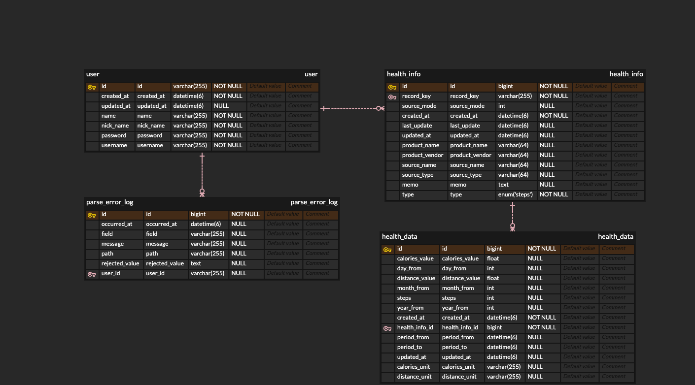
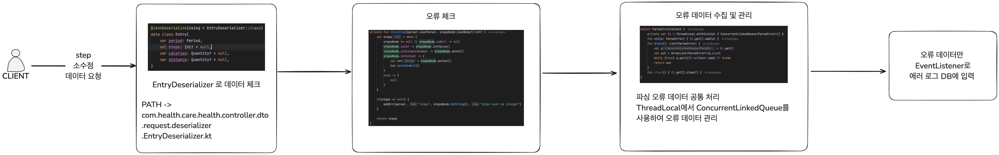

# HealthcareService

## 🚀 실행 방법
```shell
# 실행 권한 부여
# chmod +x startup.sh

# 로컬실행시 DB 생성 필요
# CREATE DATABASE health_mng CHARACTER SET utf8mb4 COLLATE utf8mb4_unicode_ci;

# 실행
./startup.sh
````

## API 문서 (Swagger)
- 주소: http://localhost:8080/api/swagger/index.html

```shell
root
├── HealthcareServiceApplication.kt        # Spring Boot 메인 실행 클래스
│
├── common/                                # 공통 모듈 (전역 상수, 공통 DTO, 예외처리 등)
│   ├── constants/
│   │   ├── GlobalConstants.kt             # 시스템 전역 상수 정의 (예: 날짜 포맷, 기본값)
│   │   └── ResponseMessages.kt            # 공통 응답 메시지 정의
│   ├── domain/
│   │   ├── BasicEntity.kt                 # 엔티티 공통 속성 (생성일, 수정일 등) 추상 클래스
│   │   └── entity/
│   │       ├── ParseErrorLog.kt           # 파싱 에러 로그 엔티티
│   │       └── ParseErrorLogRepository.kt # 파싱 에러 로그용 JPA 리포지토리
│   ├── dto/
│   │   ├── event/
│   │   │   ├── ParseError.kt              # 파싱 에러 이벤트 DTO
│   │   │   └── ParseErrorList.kt          # 파싱 에러 리스트 DTO
│   │   ├── exception/
│   │   │   └── FieldError.kt              # 필드 유효성 검증 에러 DTO
│   │   └── page/
│   │       └── PageResponse.kt            # 공통 페이지 응답 DTO
│   ├── error/
│   │   └── parse/
│   │       └── ParseErrorContext.kt       # 파싱 에러 컨텍스트 관리
│   ├── event/
│   │   └── parese/
│   │       └── ParseErrorSavedListener.kt # 파싱 에러 발생 후 이벤트 리스너
│   ├── exception/
│   │   ├── CustomAuthenticationException.kt # 인증 실패 시 예외 정의
│   │   ├── GlobalExceptionHandler.kt        # @RestControllerAdvice 전역 예외 처리
│   │   ├── MissingUserIdException.kt        # 사용자 ID 누락 예외
│   │   └── UserNotFoundException.kt         # 사용자 미존재 예외
│   └── reponse/
│       ├── CommonRes.kt                   # API 공통 응답 포맷 (success, data, message 등)
│       └── ResponseMsg.kt                 # 공통 응답 메시지 Wrapper
│
├── config/                                # 설정 관련 클래스
│   ├── JpaConfig.kt                       # JPA 설정 (Auditing 등)
│   ├── P6SpyConfig.kt                     # P6Spy SQL 로깅 설정
│   ├── QueryDslConfig.kt                  # QueryDSL 설정
│   ├── SecurityConfig.kt                  # Spring Security 설정
│   ├── WebConfig.kt                       # WebMvc 설정 (CORS, MessageConverter 등)
│   └── security/
│       ├── JwtAuthenticationEntryPoint.kt # 인증 실패 핸들러 (401 처리)
│       ├── JwtRequestFilter.kt            # JWT 인증 필터 (요청 인터셉트)
│       └── JwtUtil.kt                     # JWT 토큰 생성 및 검증 유틸
│
├── health/                                # 헬스 데이터 관리 도메인
│   ├── controller/
│   │   ├── HealthController.kt            # 헬스 데이터 API 엔드포인트
│   │   └── dto/
│   │       ├── request/
│   │       │   ├── HealthSaveRequest.kt   # 헬스 데이터 저장 요청 DTO
│   │       │   ├── HealthSearchRequest.kt # 헬스 데이터 조회 요청 DTO
│   │       │   └── deserializer/
│   │       │       ├── DateTimeDeserializer.kt # 날짜 포맷 커스텀 역직렬화
│   │       │       └── EntryDeserializer.kt    # 헬스 데이터 항목 역직렬화
│   │       └── response/
│   │           └── HealthDataResponse.kt  # 헬스 데이터 응답 DTO
│   ├── domain/
│   │   ├── HealthData.kt                  # 헬스 측정 데이터 엔티티
│   │   ├── HealthInfo.kt                  # 사용자별 헬스 정보 엔티티
│   │   └── enums/
│   │       ├── HealthInfoType.kt          # 헬스 정보 타입 Enum
│   │       └── SearchType.kt              # 조회 구분 Enum (Daily/Monthly 등)
│   ├── mapper/
│   │   └── HealthMapper.kt                # DTO ↔ 엔티티 매핑
│   ├── repository/
│   │   ├── data/
│   │   │   ├── HealthDataJpaRepository.kt # JPA 리포지토리 (HealthData)
│   │   │   ├── HealthDataQueryRepository.kt # QueryDSL 기반 조회 리포지토리
│   │   │   └── HealthDataRepository.kt    # HealthData 커스텀 리포지토리
│   │   └── info/
│   │       ├── HealthInfoJpaRepository.kt # JPA 리포지토리 (HealthInfo)
│   │       └── HealthInfoRepository.kt    # HealthInfo 커스텀 리포지토리
│   └── service/
│       ├── HealthCmdService.kt            # 쓰기(Command) 서비스 인터페이스
│       ├── HealthReadService.kt           # 읽기(Query) 서비스 인터페이스
│       └── impl/
│           ├── HealthCmdServiceImpl.kt    # 헬스 데이터 저장 로직 구현
│           └── HealthReadServiceImpl.kt   # 헬스 데이터 조회 로직 구현
│
└── sign/                                  # 회원가입/로그인 도메인
    ├── controller/
    │   ├── SignController.kt              # 인증 관련 API 엔드포인트
    │   └── dto/
    │       ├── SignDTO.kt                 # Sign 관련 공통 DTO
    │       ├── request/
    │       │   ├── SignInRequest.kt       # 로그인 요청 DTO
    │       │   └── SignUpRequest.kt       # 회원가입 요청 DTO
    │       └── response/
    │           └── SignInResponse.kt      # 로그인 응답 DTO (토큰 등)
    ├── domain/
    │   └── User.kt                        # 사용자 엔티티
    ├── mapper/
    │   └── SignMapper.kt                  # DTO ↔ 엔티티 매핑
    ├── repository/
    │   ├── SignJpaRepository.kt           # User 엔티티용 JPA 리포지토리
    │   └── SignRepository.kt              # Sign 관련 커스텀 리포지토리
    └── service/
        ├── SignCmdService.kt              # 쓰기(Command) 서비스 인터페이스
        ├── SignReadService.kt             # 읽기(Query) 서비스 인터페이스
        └── impl/
            ├── SignCmdServiceImpl.kt      # 회원가입/로그인 저장 로직 구현
            └── SignReadServiceImpl.kt     # 사용자 조회/인증 로직 구현
```

## data.sql 정보
- 서버 실행시 데이터 input
- PATH : ./src/main/resources/data.sql
  - 테스트 계정 비밀번호: 1q2w3e4r!@#$

### ERD


### ParseErrorLog 테이블 컬럼 설명

| 컬럼명           | 타입          | 널 허용 | 설명                                                   |
|------------------|---------------|---------|--------------------------------------------------------|
| id               | BIGINT (PK)   | N       | 고유 식별자 (자동 증가)                                |
| user_id          | BIGINT (FK)   | N       | 오류 발생 사용자 ID (User 엔티티 참조)                 |
| path             | VARCHAR(255)  | N       | 오류 발생 위치 (예: JSON 경로, 필드 경로)              |
| field            | VARCHAR(255)  | N       | 오류 필드명                                            |
| rejected_value   | TEXT          | Y       | 거부된 값 (유효성 검사 실패 값, TEXT 타입)             |
| message          | VARCHAR(500)  | N       | 오류 메시지 (예: Invalid format, 필수 값 누락 등)      |
| occurred_at      | DATETIME      | N       | 오류 발생 시각 (기본값: 현재 시간)                     |


### HealthInfo 테이블 컬럼 설명

| 컬럼명         | 타입          | 널 허용 | 설명                                               |
|----------------|---------------|---------|----------------------------------------------------|
| id             | BIGINT (PK)   | N       | 고유 식별자 (자동 증가)                            |
| record_key     | VARCHAR(40)   | N       | 사용자 구분 키 (recordKey)                         |
| memo           | TEXT          | Y       | 추가 메모                                          |
| last_update    | DATETIME      | Y       | 마지막 업데이트 시각                                |
| type           | VARCHAR(10)   | N       | 헬스 정보 타입 (예: 걸음수, 심박수 등)             |
| product_name   | VARCHAR(64)   | Y       | 데이터를 수집한 제품 이름                           |
| product_vendor | VARCHAR(64)   | Y       | 데이터를 수집한 벤더/제조사                        |
| source_type    | VARCHAR(64)   | Y       | 데이터 소스 타입                                    |
| source_mode    | INT           | Y       | 데이터 소스 모드                                    |
| source_name    | VARCHAR(64)   | Y       | 데이터 소스 이름                                    |
| healthDataList | - (1:N 매핑)  | Y       | 연결된 HealthData 목록 (HealthData 엔티티와 1:N 관계) |

### HealthData 테이블 컬럼 설명

| 컬럼명         | 타입          | 널 허용 | 설명                                |
|----------------|---------------|---------|-------------------------------------|
| id             | BIGINT (PK)   | N       | 고유 식별자 (자동 증가)             |
| health_info_id | BIGINT (FK)   | N       | 연결된 HealthInfo ID (FK)           |
| period_from    | DATETIME      | Y       | 데이터 기록 시작 시각               |
| period_to      | DATETIME      | Y       | 데이터 기록 종료 시각               |
| distance_unit  | VARCHAR(255)  | Y       | 이동 거리 단위 (예: km, m)          |
| distance_value | FLOAT         | Y       | 이동 거리 값                        |
| calories_unit  | VARCHAR(255)  | Y       | 칼로리 단위 (예: kcal)              |
| calories_value | FLOAT         | Y       | 칼로리 소모 값                      |
| steps          | INT           | Y       | 걸음 수                             |
| year_from      | INT           | Y       | 기록 시작 연도                      |
| month_from     | INT           | Y       | 기록 시작 월                        |
| day_from       | INT           | Y       | 기록 시작 일                        |

### User 테이블 컬럼 설명

### User
| 컬럼명   | 타입         | 널 허용 | 설명                                       |
|----------|--------------|---------|--------------------------------------------|
| id       | VARCHAR(36)  | N       | 고유 식별자(UUID, 저장 시 자동 생성)       |
| username | VARCHAR      | N (UQ)  | 로그인 아이디(중복 불가)                   |
| password | VARCHAR      | N       | 비밀번호(암호화 저장)                      |
| name     | VARCHAR      | N       | 사용자 이름                                 |
| nickName | VARCHAR      | N       | 사용자 닉네임                               |


## 테스트 방법
- test.http 파일 실행하여 API 요청 테스트 가능
- root에 위치

## 발생한 이슈 및 해결 방법
### 걸음 수 필드 타입 문제
#### 문제_1
> 응답/요청 값에 소수점 타입이 포함
- "steps": "688.5509846105425" 

#### 해결_1



> STEP이 간헐적으로 데이터가 전송 되고 있으니 오류 데이터만 "parse_error_log" DB Table에 저장후 수정 필요

### 기간(period) 필드 포맷 불일치
#### 문제_2
> 기간이 포맷에 맞지 않게 Reqeust 되는 문제
```json
// 예1
{
  "period": {
    "from": "2024-12-16 22:30:00",
    "to": "2024-12-16 22:40:00"
  }
}
```
```json
// 예 2
{
    "period": {
      "from": "2024-11-14T21:20:00+0000",
      "to": "2024-11-14T21:30:00+0000"
    }
}
```

#### 해결_2
> com.health.care.health.controller.dto.request.deserializer.DateTimeDeserializer
> 에서 DateFormat 체크


```kotlin
private val formats = listOf(
   DateTimeFormatter.ofPattern("yyyy-MM-dd HH:mm:ss"),
   DateTimeFormatter.ofPattern("yyyy-MM-dd'T'HH:mm:ssZ")
)

override fun deserialize(p: JsonParser, ctxt: DeserializationContext): LocalDateTime {
   val text = p.text.trim()
   for (fmt in formats) {
      try {
         return LocalDateTime.parse(text, fmt)  // 위 리스트 포맷안에 포함되어 있다면 LocalDateTime으로 변환후 Return
      } catch (_: Exception) {}
   }
   throw IllegalArgumentException("Unsupported date format: $text")
}
```

#### 문제_3
* 어떤 데이터로 받을지
* 사용자 아이디로 로그인 하는건지
* recordkey를 보내주는데 이거는 사용자 index로 로그인시 직접 입력이 되는건지
* INPUT_DATA1~4.json 로그인 없이 입력 가능한지 (현재는 로그인 후 입력 가능)
* 기획 적인 문제 확인 필요

#### 해결_3
> 기획자와 이야기 후 확인 필요

## 결과물

### recordkey - 7836887b-b12a-440f-af0f-851546504b13
#### Daily
| Daily      | Steps | calories | distance | recordkey |
| ---------- | ----- | -------- | -------- | --------- |
|2024-12-16 |	6432|	257.4299857020378| 	4.856479777954519|	7836887b-b12a-440f-af0f-851546504b13|
|2024-12-15 |	4245|	167.8300003260374| 	3.209540043724701|	7836887b-b12a-440f-af0f-851546504b13|
|2024-12-14 |	4797|	191.79998271167278| 	3.65706970077008|	7836887b-b12a-440f-af0f-851546504b13|
|2024-12-13 |	8102|	325.21995013952255| 	6.12630960624665|	7836887b-b12a-440f-af0f-851546504b13|
|2024-12-12 |	7093|	285.36995419859886| 	5.414469503797591|	7836887b-b12a-440f-af0f-851546504b13|
|2024-12-11 |	7513|	302.8199664950371| 	5.587589795701206|	7836887b-b12a-440f-af0f-851546504b13|
|2024-12-10 |	6546|	265.0899788439274| 	4.96174985403195|	7836887b-b12a-440f-af0f-851546504b13|
|2024-12-09 |	8659|	346.1499652862549| 	6.613179887644947|	7836887b-b12a-440f-af0f-851546504b13|
|2024-12-08 |	2943|	115.39999435842037| 	2.2430599625222385|	7836887b-b12a-440f-af0f-851546504b13|
|2024-12-07 |	6835|	277.1999680250883| 	5.154009454417974|	7836887b-b12a-440f-af0f-851546504b13|
|2024-12-06 |	6069|	244.9899601340294| 	4.600989607162774|	7836887b-b12a-440f-af0f-851546504b13|
|2024-12-05 |	13942|	549.5799497067928| 	10.450879800133407|	7836887b-b12a-440f-af0f-851546504b13|
|2024-12-04 |	11100|	452.91997034847736| 	8.327119757654145|	7836887b-b12a-440f-af0f-851546504b13|
|2024-12-03 |	9253|	366.01997473835945| 	6.9904797449707985|	7836887b-b12a-440f-af0f-851546504b13|
|2024-12-02 |	5152|	209.00998178124428| 	3.905699728988111|	7836887b-b12a-440f-af0f-851546504b13|
|2024-12-01 |	6911|	279.00999823212624| 	5.277709938120097|	7836887b-b12a-440f-af0f-851546504b13|
|2024-11-30 |	6409|	258.4599805921316| 	4.840769791975617|	7836887b-b12a-440f-af0f-851546504b13|
|2024-11-29 |	7773|	307.3399833738804| 	5.84511992149055|	7836887b-b12a-440f-af0f-851546504b13|
|2024-11-28 |	9423|	385.35995399951935| 	7.048409771174192|	7836887b-b12a-440f-af0f-851546504b13|
|2024-11-27 |	11522|	475.3499541580677| 	8.73671955987811|	7836887b-b12a-440f-af0f-851546504b13|
|2024-11-26 |	6815|	280.829973757267| 	5.111829798668623|	7836887b-b12a-440f-af0f-851546504b13|
|2024-11-25 |	6396|	256.8099681288004| 	4.917579638771713|	7836887b-b12a-440f-af0f-851546504b13|
|2024-11-24 |	6285|	249.50998228788376| 	4.824589901138097|	7836887b-b12a-440f-af0f-851546504b13|
|2024-11-23 |	7619|	303.1099579632282| 	5.753029355313629|	7836887b-b12a-440f-af0f-851546504b13|
|2024-11-22 |	9692|	385.83993573486805| 	7.3932292656973|	7836887b-b12a-440f-af0f-851546504b13|
|2024-11-21 |	5952|	236.67996318638325| 	4.463269648142159|	7836887b-b12a-440f-af0f-851546504b13|
|2024-11-20 |	7762|	310.8299667239189| 	5.841579857748002|	7836887b-b12a-440f-af0f-851546504b13|
|2024-11-19 |	5857|	232.44996318221092| 	4.4839393072761595|	7836887b-b12a-440f-af0f-851546504b13|
|2024-11-18 |	7928|	316.69997957348824| 	6.034049915149808|	7836887b-b12a-440f-af0f-851546504b13|
|2024-11-17 |	7390|	288.4899660050869| 	5.608009681571275|	7836887b-b12a-440f-af0f-851546504b13|
|2024-11-16 |	10717|	425.5299477279186| 	8.020479648839682|	7836887b-b12a-440f-af0f-851546504b13|
|2024-11-15 |	7243|	289.2099559158087| 	5.419489684980363|	7836887b-b12a-440f-af0f-851546504b13|

| Monthly | Steps | calories | distance | recordkey |
| ------- | ----- | -------- | -------- | --------- |
|2024-12|	115592	|4635.839581027627|	87.37633616384119	|7836887b-b12a-440f-af0f-851546504b13|
|2024-11|	124783	|5002.499432310462 |	94.34209474781528|	7836887b-b12a-440f-af0f-851546504b13|


### recordkey - 3b87c9a4-f983-4168-8f27-85436447bb57
#### Daily
| Daily      | Steps | calories | distance | recordkey |
| ---------- | ----- | -------- | -------- | --------- |
|2024-12-16|	9482|	334.3399731218815|	7.2512999954633415|	3b87c9a4-f983-4168-8f27-85436447bb57|
|2024-12-15|	3412|	116.97999539971352|	2.6329600499011576|	3b87c9a4-f983-4168-8f27-85436447bb57|
|2024-12-14|	4154|	145.7699911147356|	3.1663400339893997|	3b87c9a4-f983-4168-8f27-85436447bb57|
|2024-12-13|	9349|	314.539973333478|	7.218349938746542|	3b87c9a4-f983-4168-8f27-85436447bb57|
|2024-12-12|	10929|	372.06996051967144|	8.391009909566492|	3b87c9a4-f983-4168-8f27-85436447bb57|
|2024-12-11|	10467|	350.55997046642005|	8.13616999151418|	3b87c9a4-f983-4168-8f27-85436447bb57|
|2024-12-10|	9249|	320.2999855056405|	7.158499996643513|	3b87c9a4-f983-4168-8f27-85436447bb57|
|2024-12-09|	5740|	191.1299803406|	4.466049978043884|	3b87c9a4-f983-4168-8f27-85436447bb57|
|2024-12-08|	5353|	183.43999338150024|	4.201040052808821|	3b87c9a4-f983-4168-8f27-85436447bb57|
|2024-12-07|	5063|	220.86999554932117|	4.446939828339964|	3b87c9a4-f983-4168-8f27-85436447bb57|
|2024-12-06|	12300|	419.2599161565304|	9.488850786816329|	3b87c9a4-f983-4168-8f27-85436447bb57|
|2024-12-05|	10329|	375.1299700140953|	7.868419944308698|	3b87c9a4-f983-4168-8f27-85436447bb57|
|2024-12-04|	8507|	308.8199750036001|	6.447079967241734|	3b87c9a4-f983-4168-8f27-85436447bb57|
|2024-12-03|	11103|	383.3199715465307|	8.527580062393099|	3b87c9a4-f983-4168-8f27-85436447bb57|
|2024-12-02|	8194|	294.7799688577652|	6.209019924513996|	3b87c9a4-f983-4168-8f27-85436447bb57|
|2024-12-01|	6920|	228.8199820816517|	5.487350152805448|	3b87c9a4-f983-4168-8f27-85436447bb57|
|2024-11-30|	3114|	107.86999477446079|	2.3597999922931194|	3b87c9a4-f983-4168-8f27-85436447bb57|
|2024-11-29|	8698|	303.98997989296913|	6.68351010652259|	3b87c9a4-f983-4168-8f27-85436447bb57|
|2024-11-28|	9769|	347.76997965574265|	7.386700191535056|	3b87c9a4-f983-4168-8f27-85436447bb57|
|2024-11-27|	9566|	350.05996510386467|	7.253210075665265|	3b87c9a4-f983-4168-8f27-85436447bb57|
|2024-11-26|	7930|	281.5199345648289|	6.081570295616984|	3b87c9a4-f983-4168-8f27-85436447bb57|
|2024-11-25|	8660|	308.7399460673332|	6.698340095113963|	3b87c9a4-f983-4168-8f27-85436447bb57|
|2024-11-24|	9089|	329.33995455503464|	6.969780245330185|	3b87c9a4-f983-4168-8f27-85436447bb57|
|2024-11-23|	5117|	194.739960283041|	3.9776800172403455|	3b87c9a4-f983-4168-8f27-85436447bb57|
|2024-11-22|	8496|	291.91996371746063|	6.54098076839|	3b87c9a4-f983-4168-8f27-85436447bb57|
|2024-11-21|	9114|	327.43995267152786|	6.932690346147865|	3b87c9a4-f983-4168-8f27-85436447bb57|
|2024-11-20|	10055|	341.25993648171425|	7.717340256553143|	3b87c9a4-f983-4168-8f27-85436447bb57|
|2024-11-19|	8203|	305.67995378375053|	6.327780225779861|	3b87c9a4-f983-4168-8f27-85436447bb57|
|2024-11-18|	13291|	453.14989468455315|	10.299719921313226|	3b87c9a4-f983-4168-8f27-85436447bb57|
|2024-11-17|	5179|	183.68998301029205|	3.98311011120677|	3b87c9a4-f983-4168-8f27-85436447bb57|
|2024-11-16|	5075|	199.2399953752756|	4.263790308963507|	3b87c9a4-f983-4168-8f27-85436447bb57|
|2024-11-15|	9589|	345.3599342703819|	7.243230168707669|	3b87c9a4-f983-4168-8f27-85436447bb57|


### Monthly

| Monthly | Steps | calories | distance | recordkey |
| ------- | ----- | -------- | -------- | --------- |
|2024-12|	130551|	4560.129602393135	|101.0969606130966|	3b87c9a4-f983-4168-8f27-85436447bb57 |
|2024-11|	130945|	4671.769328892231	|100.71923312637955|	3b87c9a4-f983-4168-8f27-85436447bb57|

### recordkey - 7b012e6e-ba2b-49c7-bc2e-473b7b58e72e
### Daily

| Daily      | Steps | calories | distance | recordkey |
| ---------- | ----- | -------- | -------- | --------- |
|2024-12-15|	1044|	0.0|	0.8352000112645328|	7b012e6e-ba2b-49c7-bc2e-473b7b58e72e|
|2024-12-14|	2349|	0.0|	1.8792000021785498|	7b012e6e-ba2b-49c7-bc2e-473b7b58e72e|
|2024-12-13|	2816|	0.0|	2.252800043555908|	7b012e6e-ba2b-49c7-bc2e-473b7b58e72e|
|2024-12-12|	1462|	0.0|	1.1695999944931827|	7b012e6e-ba2b-49c7-bc2e-473b7b58e72e|
|2024-12-11|	1208|	0.0|	0.9664000021293759|	7b012e6e-ba2b-49c7-bc2e-473b7b58e72e|
|2024-12-10|	2425|	0.0|	1.940000029746443|	7b012e6e-ba2b-49c7-bc2e-473b7b58e72e|
|2024-12-09|	770|	0.0|	0.6159999999217689|	7b012e6e-ba2b-49c7-bc2e-473b7b58e72e|
|2024-12-08|	463|	0.0|	0.3703999938443303|	7b012e6e-ba2b-49c7-bc2e-473b7b58e72e|
|2024-12-07|	521|	0.0|	0.41680000140331686|	7b012e6e-ba2b-49c7-bc2e-473b7b58e72e|
|2024-12-06|	686|	0.0|	0.5487999960896559|	7b012e6e-ba2b-49c7-bc2e-473b7b58e72e|
|2024-12-05|	1462|	0.0|	1.1696000071242452|	7b012e6e-ba2b-49c7-bc2e-473b7b58e72e|
|2024-12-04|	1082|	0.0|	0.865599999204278|	7b012e6e-ba2b-49c7-bc2e-473b7b58e72e|
|2024-12-03|	1127|	0.0|	0.901600003708154|	7b012e6e-ba2b-49c7-bc2e-473b7b58e72e|
|2024-12-02|	459|	0.0|	0.3672000030637719|	7b012e6e-ba2b-49c7-bc2e-473b7b58e72e|
|2024-12-01|	298|	0.0|	0.23840000201016665|	7b012e6e-ba2b-49c7-bc2e-473b7b58e72e|
|2024-11-30|	1437|	0.0|	1.1496000001206994|	7b012e6e-ba2b-49c7-bc2e-473b7b58e72e|
|2024-11-29|	1545|	0.0|	1.2360000016633421|	7b012e6e-ba2b-49c7-bc2e-473b7b58e72e|
|2024-11-28|	1127|	0.0|	0.901600003708154|	7b012e6e-ba2b-49c7-bc2e-473b7b58e72e|
|2024-11-27|	990|	0.0|	0.7920000124722719|	7b012e6e-ba2b-49c7-bc2e-473b7b58e72e|
|2024-11-26|	1267|	0.0|	1.0135999927879311|	7b012e6e-ba2b-49c7-bc2e-473b7b58e72e|
|2024-11-25|	923|	0.0|	0.7383999889716506|	7b012e6e-ba2b-49c7-bc2e-473b7b58e72e|
|2024-11-24|	1220|	0.0|	0.9759999876841903|	7b012e6e-ba2b-49c7-bc2e-473b7b58e72e|
|2024-11-23|	1064|	0.0|	0.851200009114109|	7b012e6e-ba2b-49c7-bc2e-473b7b58e72e|
|2024-11-22|	1563|	0.0|	1.2503999955952168|	7b012e6e-ba2b-49c7-bc2e-473b7b58e72e|
|2024-11-21|	854|	0.0|	0.6831999984569848|	7b012e6e-ba2b-49c7-bc2e-473b7b58e72e|
|2024-11-20|	596|	0.0|	0.4768000040203333|	7b012e6e-ba2b-49c7-bc2e-473b7b58e72e|
|2024-11-19|	832|	0.0|	0.6655999895883724|	7b012e6e-ba2b-49c7-bc2e-473b7b58e72e|
|2024-11-18|	557|	0.0|	0.4455999991623685|	7b012e6e-ba2b-49c7-bc2e-473b7b58e72e|
|2024-11-17|	1434|	0.0|	1.1471999832428992|	7b012e6e-ba2b-49c7-bc2e-473b7b58e72e|
|2024-11-16|	732|	0.0|	0.5856000003986992|	7b012e6e-ba2b-49c7-bc2e-473b7b58e72e|
|2024-11-15|	2173|	0.0|	1.7383999819867313|	7b012e6e-ba2b-49c7-bc2e-473b7b58e72e|
|2024-11-14|	326|	0.0|	0.2608000033069402|	7b012e6e-ba2b-49c7-bc2e-473b7b58e72e|

### Monthly

| Monthly | Steps | calories | distance | recordkey |
| ------- | ----- | -------- | -------- | --------- |
|2024-12|	18172|	0.0|	14.53760008973768	|7b012e6e-ba2b-49c7-bc2e-473b7b58e72e|
|2024-11|	18640|	0.0|	14.911999952280894	|7b012e6e-ba2b-49c7-bc2e-473b7b58e72e|


## 결과물
### recordkey - e27ba7ef-8bb2-424c-af1d-877e826b7487
### Daily

| Daily      | Steps | calories | distance | recordkey |
| ---------- | ----- | -------- | -------- | --------- |
|2024-12-15|	209|	0.0|	0.16720000794157386	|e27ba7ef-8bb2-424c-af1d-877e826b7487|
|2024-12-14|	76|	0.0|	0.06079999986104667	|e27ba7ef-8bb2-424c-af1d-877e826b7487|
|2024-12-13|	1192|	0.0|	0.9535999809158966	|e27ba7ef-8bb2-424c-af1d-877e826b7487|
|2024-12-12|	1969|	0.0|	1.5752000352367759	|e27ba7ef-8bb2-424c-af1d-877e826b7487|
|2024-12-11|	1695|	0.0|	1.356000006198883	|e27ba7ef-8bb2-424c-af1d-877e826b7487|
|2024-12-10|	2060|	0.0|	1.6479999795556068	|e27ba7ef-8bb2-424c-af1d-877e826b7487|
|2024-12-09|	1480|	0.0|	1.1840000227093697	|e27ba7ef-8bb2-424c-af1d-877e826b7487|
|2024-12-08|	760|	0.0|	0.6079999986104667	|e27ba7ef-8bb2-424c-af1d-877e826b7487|
|2024-12-07|	1108|	0.0|	0.8864000327885151	|e27ba7ef-8bb2-424c-af1d-877e826b7487|
|2024-12-06|	1904|	0.0|	1.5232000006362796	|e27ba7ef-8bb2-424c-af1d-877e826b7487|
|2024-12-05|	1121|	0.0|	0.8968000034801662	|e27ba7ef-8bb2-424c-af1d-877e826b7487|
|2024-12-04|	1018|	0.0|	0.8143999994499609	|e27ba7ef-8bb2-424c-af1d-877e826b7487|
|2024-12-03|	919|	0.0|	0.7352000176906586	|e27ba7ef-8bb2-424c-af1d-877e826b7487|
|2024-12-02|	1614|	0.0|	1.2911999896168709	|e27ba7ef-8bb2-424c-af1d-877e826b7487|
|2024-12-01|	16|	0.0|	0.012799999676644802	|e27ba7ef-8bb2-424c-af1d-877e826b7487|
|2024-11-30|	117|	0.0|	0.09359999746084213	|e27ba7ef-8bb2-424c-af1d-877e826b7487|
|2024-11-29|	861|	0.0|	0.6887999870814383	|e27ba7ef-8bb2-424c-af1d-877e826b7487|
|2024-11-28|	1961|	0.0|	1.568800000473857	|e27ba7ef-8bb2-424c-af1d-877e826b7487|
|2024-11-27|	1452|	0.0|	1.1615999988280237	|e27ba7ef-8bb2-424c-af1d-877e826b7487|
|2024-11-26|	1525|	0.0|	1.219999990426004	|e27ba7ef-8bb2-424c-af1d-877e826b7487|
|2024-11-25|	896|	0.0|	0.716800021007657	|e27ba7ef-8bb2-424c-af1d-877e826b7487|
|2024-11-24|	434|	0.0|	0.34719999553635716	|e27ba7ef-8bb2-424c-af1d-877e826b7487|
|2024-11-23|	1523|	0.0|	1.2184000052511692	|e27ba7ef-8bb2-424c-af1d-877e826b7487|
|2024-11-22|	664|	0.0|	0.5312000005505979	|e27ba7ef-8bb2-424c-af1d-877e826b7487|
|2024-11-21|	414|	0.0|	0.33120000176131725	|e27ba7ef-8bb2-424c-af1d-877e826b7487|
|2024-11-20|	98|	0.0|	0.07840000092983246	|e27ba7ef-8bb2-424c-af1d-877e826b7487|
|2024-11-19|	1166|	0.0|	0.9328000210225582	|e27ba7ef-8bb2-424c-af1d-877e826b7487|
|2024-11-18|	1565|	0.0|	1.2520000077784061	|e27ba7ef-8bb2-424c-af1d-877e826b7487|
|2024-11-17|	10|	0.0|	0.00800000037997961	|e27ba7ef-8bb2-424c-af1d-877e826b7487|
|2024-11-16|	301|	0.0|	0.24079999839887023	|e27ba7ef-8bb2-424c-af1d-877e826b7487|
|2024-11-15|	1462|	0.0|	1.1696000038646162	|e27ba7ef-8bb2-424c-af1d-877e826b7487|
|2024-11-14|	8|	0.0|	0.006399999838322401	|e27ba7ef-8bb2-424c-af1d-877e826b7487|

### Monthly

| Monthly | Steps | calories | distance | recordkey |
| ------- | ----- | -------- | -------- | --------- |
|2024-12|	17141|	0.0|	13.712800074368715|	e27ba7ef-8bb2-424c-af1d-877e826b7487|
|2024-11|	14457|	0.0	|11.565600030589849|	e27ba7ef-8bb2-424c-af1d-877e826b7487|
